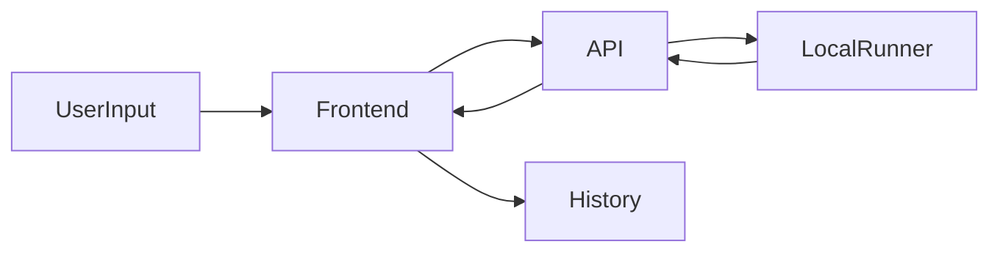

## Architecture

### Overview
Codelens is split into a React frontend and an Express backend. The frontend handles UI, history, and model views. The backend runs code locally and returns outputs.

### Data Flow

### Components
- Frontend: `frontend/` (Vite + React)
- Backend: `backend/` (Express)

### Endpoints
- `POST /api/run` - Execute code and return stdout/stderr/flowchart/steps.
- `POST /api/diagnose` - Run code and return error guidance.
- `POST /api/idea` - Generate a structured project plan (template-based).
- `POST /api/levels/submit` - Validate learning levels.

### Security Notes
- Runs only on localhost with short timeouts.
- For hackathon/demo use; not intended for untrusted public hosting.
